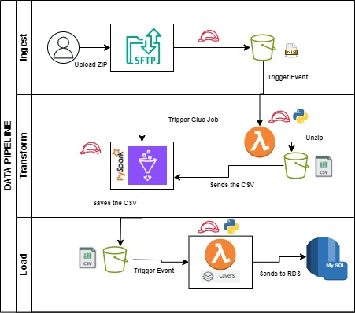
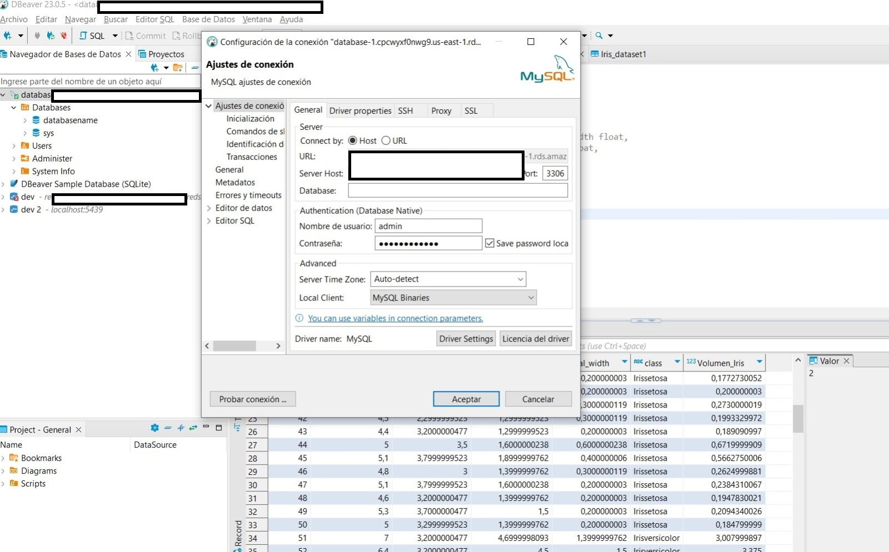
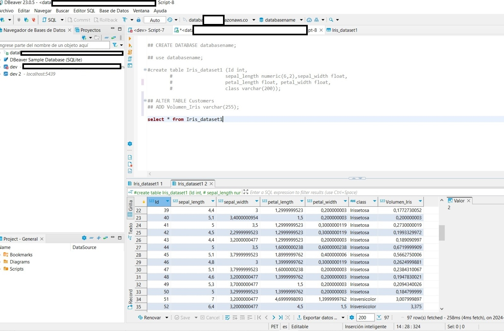

# Data_pipeline_SFTP
Deployment of an architechture using Terraform, it deploys AWS resources like RDS, lambdas, sftp's, glue and integrated them to insert data into an RDS

# AWS-SFTP-PIPELINE

ITL (ingestion, transformation and loading) Datapipeline using SFTP's, lambdas, and a gluespark job, in order to save data into an rds.

The Python.zip file contains the pymysql package in order to connect to the RDS thorugh the lambda function using a lambda layer, and the SQL_DBEAVER is the sql code to create the database and table.

This is the structure of the Data Pipeline:

This were the processes and resources created to build the DataPipeline.
The lambdas and the Glue Job have IAM roles, in order to extract data from s3 and process it.

Connect to the RDS through DBeaver in your local machine:

In your local machine Double Check if the RDS actually ingested the data:

That's it

The glue_code is made with SPARK.
Lambdas with Python, one needs a lambda layer.

The codes must be uploaded to an S3 bucket, and pulled from there using terraform.

Dbeaver Terraform SQL file is to create the table, update it and use a DB. 
